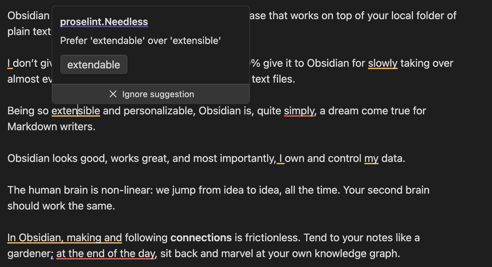
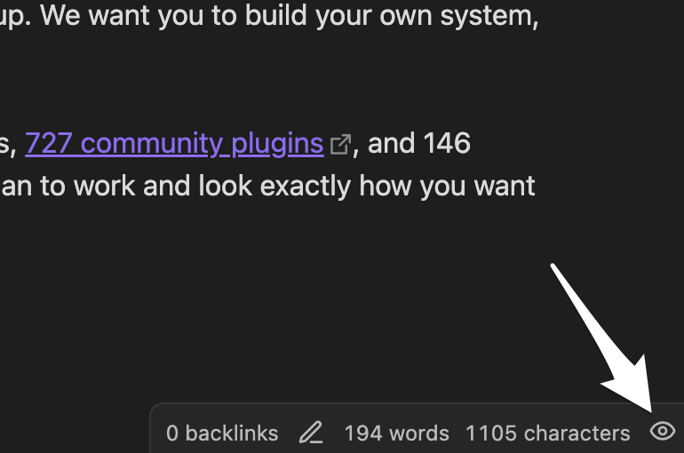
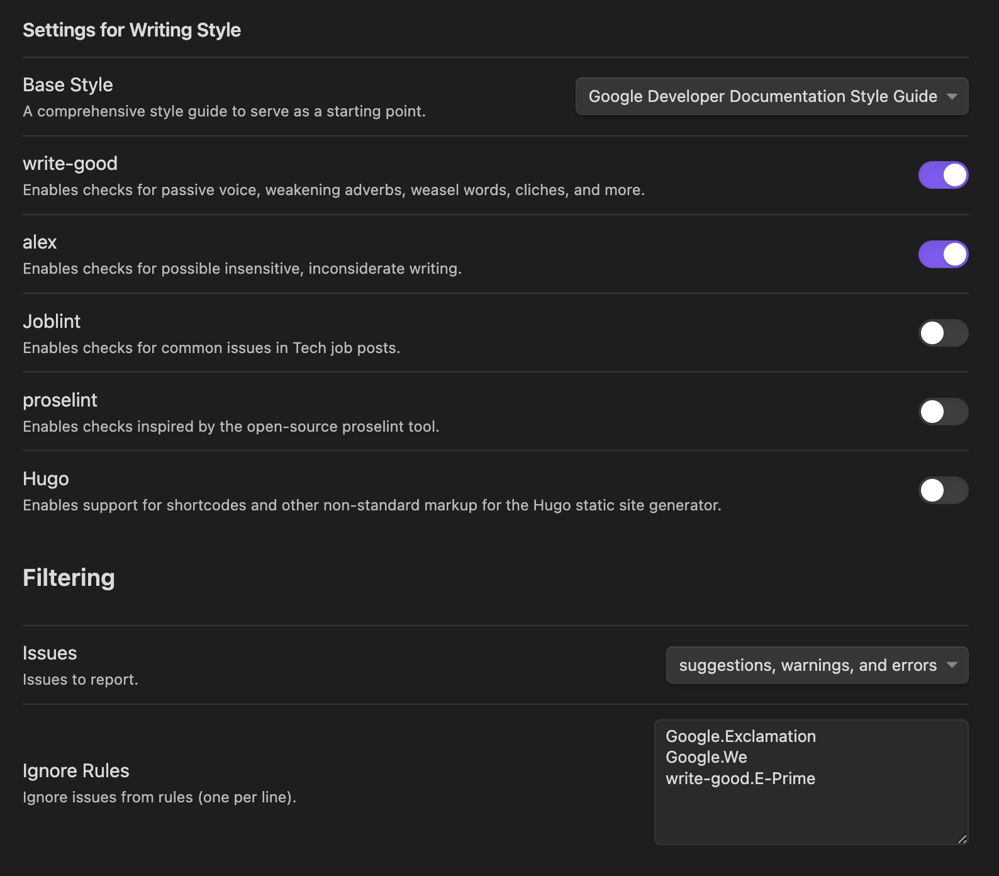

# Obsidian Writing Style Plugin

This [Obsidian](https://obsidian.md/) plugin helps you write like a pro by highlighting problematic words and phrases in your writing:

> **Note**
>
> **This plugin is in Beta.** This means you should expect bugs and other silliness, but it’s stable enough to be tried out by the adventurous.

The plugin uses the open-source [Vale](https://vale.sh) writing style linter to give you suggestions and warnings on much more than just spelling mistakes:

- Use of passive voice like _“The ball was kicked”_
- Use of wordy phrases and unnecessary words like _“by means of”_ or _“along the lines of”_
- Weasel words like _Many,_ _Exactly,_ or _Usually_
- Condescending language like _Simply_, _Obviously_, or “_everyone knows”_
- Use of clichés like _“been there, done that”_ or _“boils down to”_
- Insensitive, inconsiderate writing like gendered proverbs, ableist language, intolerant phrasing, and profanities
- And much more!

## Usage

Once installed, the plugin adds an icon in the shape of an eye in the bottom status bar:

Clicking the icon reveals a menu where it's possible to trigger a writing style check of the current document. It's also possible to toggle automatic checking as you write.

### Configuring

By default, the plugin uses [Google's developer documentation style guide](https://developers.google.com/style) as its base style guide, with the [write-good](https://github.com/errata-ai/write-good) and [alex](https://github.com/errata-ai/alex) packages enabled, but it's possible to customize this to your preferences in the plugin settings:

## Installation

### Requirements

The plugin needs the Vale prose linting tool available to do the actual writing style checks. Go to [vale.sh](https://vale.sh/docs/vale-cli/installation/) and follow the installation steps for your operating system.

### Installing the plugin

While the plugin is still in Beta, installation is a bit more involved until it's available in the Obsidian Plugin Directory:

1. Download the latest release from the [project’s releases page](https://github.com/michenriksen/obsidian-writing-style/releases)
2. Navigate to the directory of the Obsidian Vault where you want the plugin installed
3. Navigate to the hidden directory `.obsidian/plugins` inside the Vault
4. Inside the `plugins` directory, create a new directory called `obsidian-writing-style`
5. Copy `main.js`, `styles.css`, and `manifest.json` from the release into the newly created directory
6. In the Vault’s settings, the plugin should now be present under _Community plugins_ where it can be enabled and configured

## Thanks and Credits

This plugin was meant as a quick thing to _scratch my own itch._ I would like to thank and give credit to the following people and projects for making it possible to put this together so easily:

- Thanks to [Joseph Kato](https://github.com/jdkato) and his excellent [Vale](https://vale.sh/) project, which does all the heavy lifting of parsing Markdown and finding the style problems.

- Thanks to [Clemens](https://github.com/Clemens-E) and his [Obsidian LanguageTool Plugin](https://github.com/Clemens-E/obsidian-languagetool-plugin) which I forked for this project. Clemens did all the hard work of implementing the text highlighting, tooltips, and general UI. If you want even more powerful writing style checks, and don’t mind paying for a service to do it, I would highly recommend checking out his plugin.
